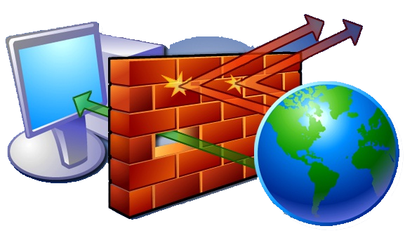
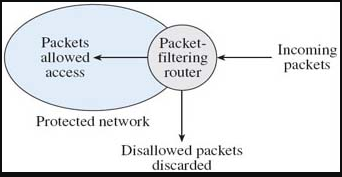
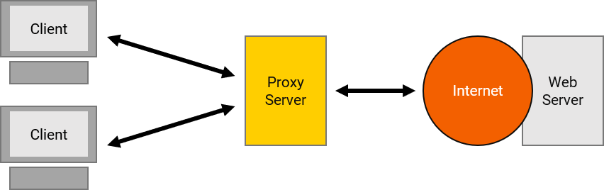
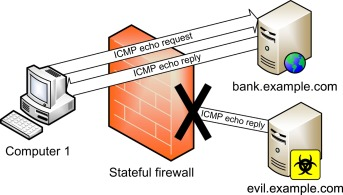

# FIREWALL

A firewall is a software or a hardware piece that acts like a filter that allows only trusted data to flow through it. A firewall is more like a filter than a wall as it allows trusted data and blocks known threats also restrict outgoing traffic to prevent spam and hacking.The term firewall was applied to networking in the late 80s and the predecessors of the firewall was routers which could filter the packets crossing them.
The basic task of a firewall is to monitor the network traffic both incoming and outgoing. Also, known as a Network firewall because of its capability to prevent unauthorized access to/from private networks. 
Without the firewall messages can pass through your system freely which can be utilized by a hacker to attain your sensitive information.
## How firewall works?
The firewall protects you during browsing for example when you search for a certain website in a browser, the request is passed through the internet to a server that stores that website and a connection is established firewall protect that connection from a hacker who tries to access this connection and steal your sensitive information
## Difference Between Hardware and Software Firewall
Hardware firewall | Software firewall
------------ | -------------
Seperate piece of hardware | Installed on your pc
Also called appliance Firewall | Also called Host Firewall
Does not use computer's resources, has its own resources | Consumes computers resources like ram, cpu etc.
Protect all the systems in the network |protect the sytem which it is installed in 
Filters traffic of all system in the network|Filters traffic of sytem which it is installed
## The Three main Types of Firewall Technologies
* Packet filltering 

Packets are a small amount of data. A packet filter is the simplest type of firewall. Dealing with each individual packet, The firewall applies its rule (access-control-list which contains a collection of permit and deny conditions) to determine which packet to allow or disallow. The firewall examines each packet based on the following criteria . 
* proxy firewall

A proxy firewall is also called an application firewall or gateway firewall.  A proxy firewall act as a gateway between the user and the internet. A proxy firewall is also a proxy server but all proxy servers are not proxy firewalls. A proxy firewall inspects all network traffic to detect and protect against threats. It can also detect network intrusion and enforce security policies. It provides security to the user system by monitoring and blocking traffic that is transmitted to and from the internet. A proxy firewall protects systems from unauthorized access. They act as a barrier between authorized and unauthorized users. A proxy firewall is also used to restrict access to sensitive sites.
* Statefull inspection

Stateful inspection, also known as dynamic filtering, is a firewall technology that monitors the state of active connections and uses this information to determine which network packets to allow through the firewall. Stateful inspection monitors communication packets over a period of time and examines both incoming and outgoing packets. Outgoing packets that request specific types of incoming packets are tracked and only those incoming packets constituting a proper response are allowed through the firewall. It works by examining the contents of data packets and then comparing them with data packets that previously passed through the firewall.
## Limitations of firewall

1. Firewall cannot block fake data packets from a trusted server.
1. direct internet traffic, hackers could sent data packets through software that have an exception in the firewall.
1. firewall will accept data from a trusted network. Hackers could hack this network and sent malicious data through it.
1. Firewall cannot stops attacks via social engineering
1. Firewall does not provide us anti-virus or anti-malware properties.
## References
1. https://www.youtube.com/watch?v=fCM86XAyQ7o&list=PLBbU9-SUUCwV7Dpk7GI8QDLu3w54TNAA6&index=5
2. www.wikipedia.org
3. https://www.fortinet.com/resources/cyberglossary/how-does-a-firewall-work
4. https://www.yourdictionary.com/
